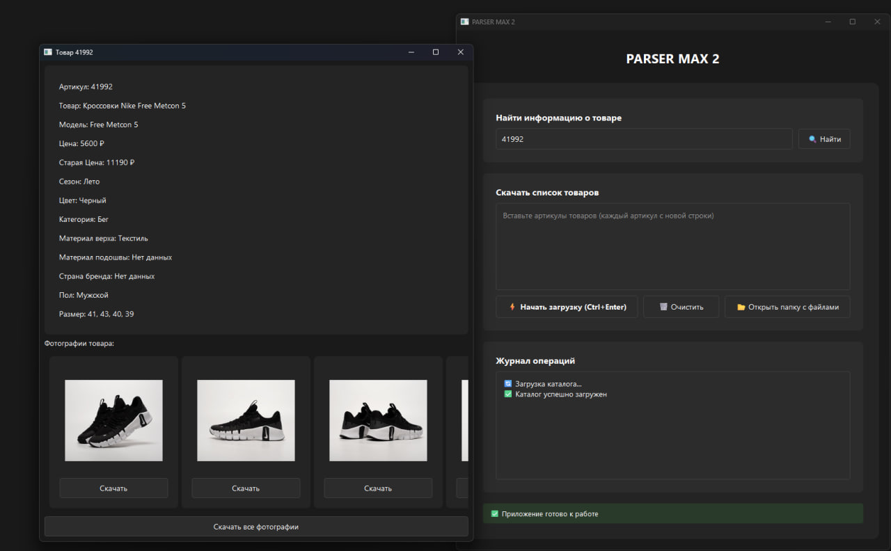

# PARSER MAX 2

Современное приложение для парсинга данных с OutmaxShop с удобным графическим интерфейсом.



## 🚀 Возможности

- Парсинг товаров по артикулам
- Загрузка изображений товаров
- Сохранение информации о размерах
- Многопоточная обработка данных
- Современный минималистичный интерфейс
- Автоматическое создание структуры папок

## 📋 Требования

- Windows 10/11
- Python 3.8 или выше
- Подключение к интернету

## 🔧 Установка

### Готовый exe-файл

1. Скачайте последнюю версию из раздела [Releases](../../releases)
2. Распакуйте архив
3. Запустите `PARSER MAX 2.exe`

### Установка из исходного кода

```bash
# Клонируем репозиторий
git clone https://github.com/your-username/parser-max-2.git

# Переходим в директорию проекта
cd parser-max-2

# Устанавливаем зависимости
pip install -r requirements.txt

# Запускаем приложение
python main.py
```

## 🛠 Сборка из исходного кода

1. Убедитесь, что у вас установлен Python 3.8 или выше
2. Запустите `compile.bat`
3. После завершения компиляции, exe-файл будет находиться в папке `dist`

## 📝 Использование

1. Запустите приложение
2. Введите артикулы товаров (каждый с новой строки)
3. Нажмите кнопку "Начать загрузку" или Ctrl+Enter
4. Дождитесь завершения загрузки
5. Результаты будут сохранены в папке `products`

## 🗂 Структура проекта

```
parser-max-2/
├── main.py              # Основной код приложения
├── compile.bat          # Скрипт для компиляции
├── parser.spec          # Конфигурация PyInstaller
├── requirements.txt     # Зависимости проекта
├── icon.ico            # Иконка приложения
└── products/           # Папка с результатами
    └── [артикул]/      # Папка для каждого товара
        ├── images/     # Изображения товара
        └── info.txt    # Информация о товаре
```

### Готовое приложение

1. [Скачайте PARSER MAX 2.exe](https://github.com/divangames/PARSER-MAX-2/blob/main/dist/PARSER%20MAX%202.exe)
2. Запустите скачанный файл
3. Готово! Никаких дополнительных действий не требуется

## ⌨️ Горячие клавиши

- `Ctrl + Enter` - Начать загрузку
- `Ctrl + C` - Копировать
- `Ctrl + V` - Вставить
- `Ctrl + A` - Выделить всё

## 🔄 Обновления

Следите за обновлениями в разделе [Releases](../../releases)

## 🐛 Известные проблемы

- При первом запуске может потребоваться некоторое время для загрузки каталога
- Необходимо стабильное интернет-соединение

## 📄 Лицензия

Распространяется под лицензией MIT. Смотрите файл [LICENSE](LICENSE) для получения дополнительной информации.

## 🤝 Участие в проекте

Если вы хотите внести свой вклад в проект:

1. Сделайте форк репозитория
2. Создайте ветку для вашей функции (`git checkout -b feature/AmazingFeature`)
3. Зафиксируйте изменения (`git commit -m 'Add some AmazingFeature'`)
4. Отправьте изменения в ваш форк (`git push origin feature/AmazingFeature`)
5. Откройте Pull Request
## 📞 Контакты

Если у вас возникли вопросы или предложения:

- **ВКонтакте:** [limited_edition_24](https://vk.com/limited_edition_24)
- **Telegram:** [@delbraun](https://t.me/delbraun)
